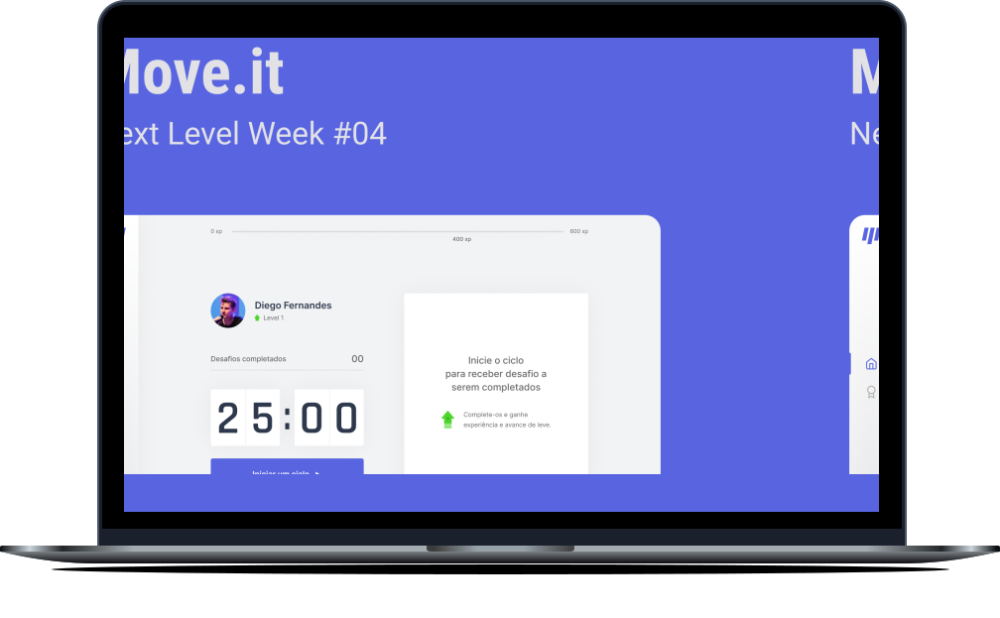

<h1 align="center">
  
</h1>

<p align="center">
  <a href="#-tecnologias">Tecnologias</a>&nbsp;&nbsp;&nbsp;|&nbsp;&nbsp;&nbsp;
  <a href="#-uso">Uso</a>&nbsp;&nbsp;&nbsp;|&nbsp;&nbsp;&nbsp;
  <a href="#-projeto">Projeto</a>&nbsp;&nbsp;&nbsp;|&nbsp;&nbsp;&nbsp;
  <a href="#-layout">Layout</a>&nbsp;&nbsp;&nbsp;|&nbsp;&nbsp;&nbsp;
  <a href="#-licença">Licença</a>
</p>

<p align="center">
  

  
</p>

<br>

<p align="center">
  

  <br>
  <a href="https://moveit-gutemberg.vercel.app/">
    <button style="background-color: #1374ef; color: #fff; border: none; width: 104px; height: 36px; border-radius: 5px; cursor: pointer">Preview</button>
  </a>
</p>

## 🧪 Tecnologias

Esse projeto foi desenvolvido com as seguintes tecnologias:

- TypeScript
- ReactJS
- NextJS

## 🚀 Uso

```bash 
git clone https://github.com/gutemberg-jhonata/moveit.git
cd moveit
yarn dev
```

## 💻 Projeto

O Moveit é uma aplicação desenvolvida durante a 4º edição do evento NLW> Utilizando da técnica pomodoro, o Moveit tem como objetivo incentivar os desenvolvedores a se exercitarem, durante sua jornada de trabalho ou estudos.

## 🔖 Layout

Você pode visualizar o layout do projeto através [desse link](https://www.figma.com/file/c14s9MkwsjvECJOYruH731/Move.it-1.0). É necessário ter conta no [Figma](https://figma.com) para acessá-lo.

## :memo: Licença

Esse projeto está sob a licença MIT. Veja o arquivo [LICENSE](.github/LICENSE.md) para mais detalhes.
